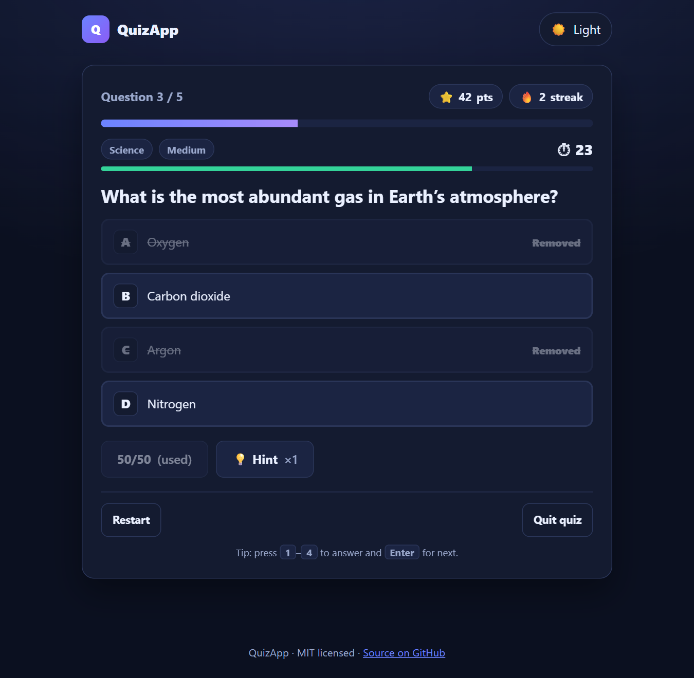
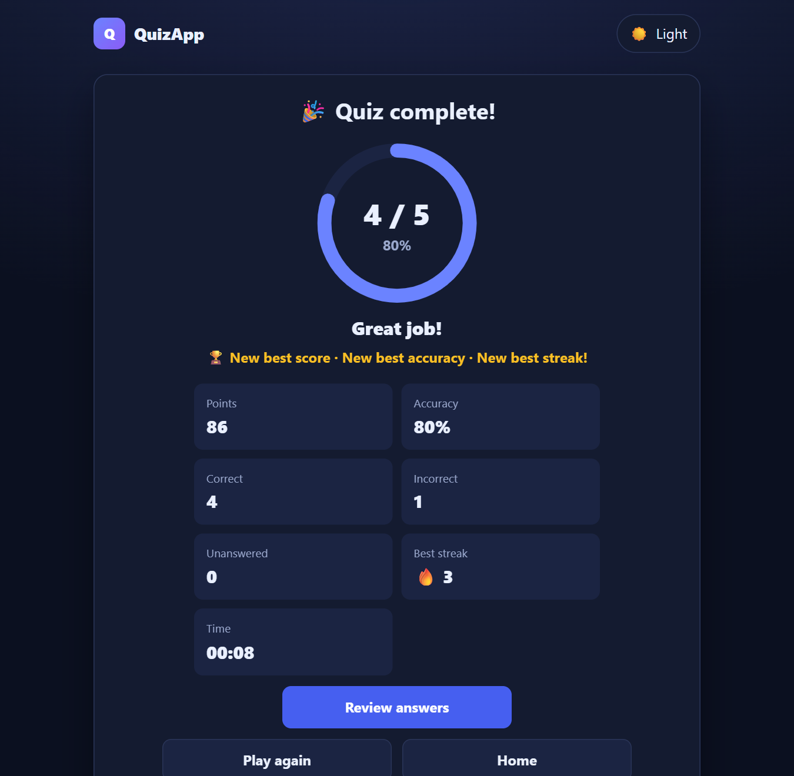

# QuizApp

A polished, dependency-free quiz platform: pick a category and difficulty, beat the clock, build a streak, then review what you missed.

[](https://shriyap1966.github.io/QuizApp/)
[](https://github.com/ShriyaP1966/QuizApp/actions/workflows/tests.yml)


[](LICENSE)

## 🎮 Play QuizApp

**[▶️ Play the quiz → shriyap1966.github.io/QuizApp](https://shriyap1966.github.io/QuizApp/)**

<p align="center">
  
  
</p>

## Features

- **108 questions** across 6 categories (General Knowledge, Science, Technology, Mathematics, History, Geography) and 3 difficulty levels, or mix them
- **Configurable rounds**: 5–20 questions (never more than available) and 10/20/30 s per question
- **Shuffled** question order and answer order every game
- **Countdown timer** that turns red when low; timeouts are handled safely and can't double-score
- **Scoring**: 10 / 20 / 30 points by difficulty, plus a streak bonus (+2 per correct answer in a row, up to +10)
- **Lifelines**: one 50/50 and one question-specific hint per quiz
- **Instant feedback** with explanations, then a **results ring** and a full **answer review**
- **Statistics** saved in your browser: best score, accuracy, best streak, per-category accuracy, with reset
- **Dark / light theme**, responsive down to phones, keyboard-friendly (`1`–`4` to answer, `Enter` for next), non-colour-only feedback

## How it works

```
index.html + style.css      screens and theme
js/data.js                  question bank (category, difficulty, hint, explanation)
js/engine.js                selection, shuffling, scoring, streaks, lifelines (no DOM)
js/storage.js               localStorage stats, theme and last settings
js/ui.js                    rendering, timer, event wiring
tests/run.js                42 unit tests for the engine and storage
```

The engine is pure logic, so it is unit-tested in Node and reused unchanged by the browser UI. Nothing is sent anywhere; stats never leave your device.

## Tech stack

Plain HTML, CSS and JavaScript. No framework, build step, backend or external API.

## Run locally

```bash
git clone https://github.com/ShriyaP1966/QuizApp.git
cd QuizApp
npx serve .        # or: python -m http.server  (or just open index.html)
npm test           # runs the unit tests (Node 18+)
```

## Future improvements

- More questions and categories
- Optional sound effects with a mute toggle
- Export/share a result card
